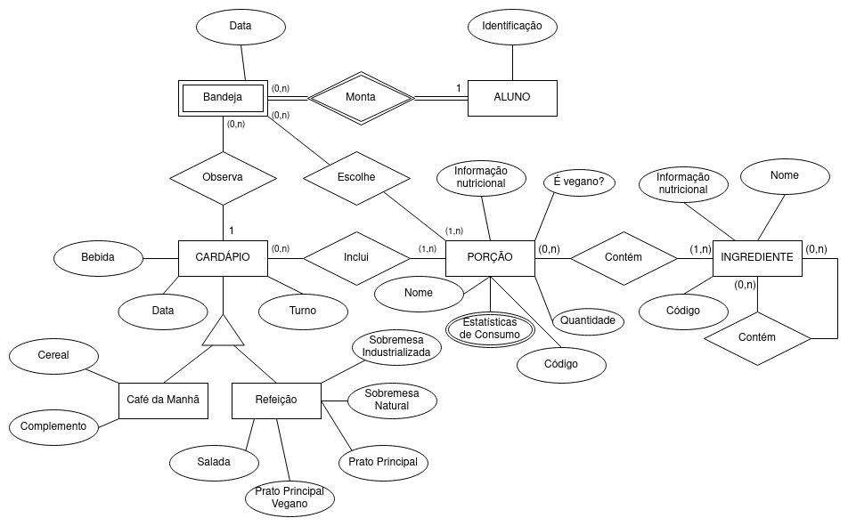

# Equipe União Vasko

# Subgrupo A
* Gabriel de Carvalho Silva Nascimento - 222103
* Breno Shigeki Guimarães Nishimoto - 220599
* Mateus da Costa e Silva Rios Alves de Andrade - 230806

# Modelo Conceitual

Diagrama ER Revisado

# Mapeamento para o Modelo Relacional
~~~
ALUNO(_RA_, Nome)
BANDEJA(_RA_, _Data_, _Turno_, Porções)
  Dono chave estrangeira -> ALUNO(RA)
CAFÉ_DA MANHA(_Data_, _Turno_, Bebida, Cereal, Complemento)
REFEIÇÃO(_Data_, _Turno_, Bebida, Salada, Prato Principal Vegano, Prato Principal, Sobremesa Natural, Sobremesa Industrializada)
PORÇÃO(_Código_, Informação Nutricional, É Vegano, Quantidade, Estatísticas de Consumo)
INGREDIENTE(_Código_, Informação Nutricional, Ingredientes)
~~~